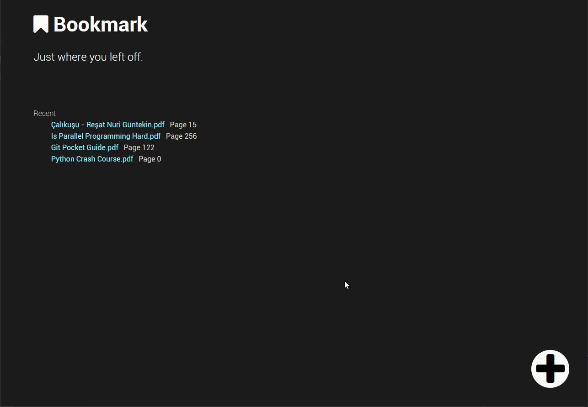

# What is :bookmark: Bookmark

Bookmark is app that saves your last pages on a `pdf` document. So you can continue reading where you left off.

# Why Bookmark ?

In order to get rid of phenomenon showed in the picture below

## Requirements

-   Python 3.4 or higher
-   Firefox Browser

## Dependencies

-   Selenium
-   Jinja2

Development:
    #Create virtual env
    virtualenv devenv

    #install dependencies
    python install -r requirements.txt

Run:

    git clone https://github.com/ByK95/bookmark
    cd bookmark
    pip install -r requirements.txt
    python bookmark.py

# FAQ

## Adding books

# Development
    Install required tools:
        pip install coverage

    Runing tests:
        python -m unittest discover

    Coverage:
        coverage run -m unittest discover
        coverage-badge -o ./tools/coverage.svg

# Contributing

Any contribution is welcome.
