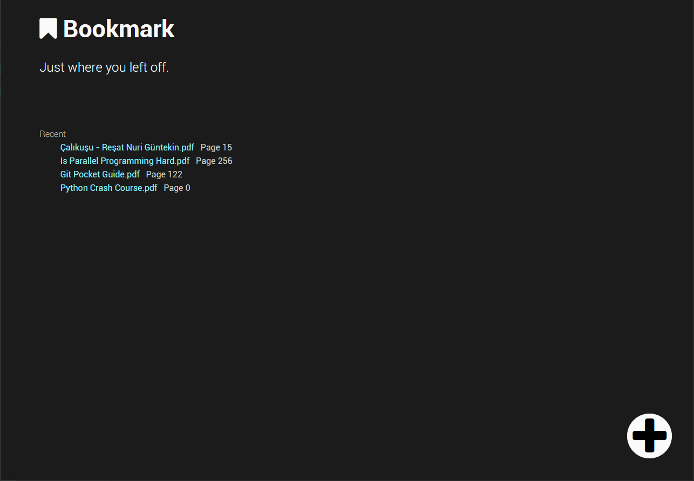

# What is :bookmark: Bookmark

Bookmark is app that saves your last pages on a `pdf` document. So you can continue reading where you left off.

# Why Bookmark ?

In order to get rid of phenomenon showed in the picture below

## Requirements

-   Python 3.4 or higher
-   Firefox Browser

## Dependencies

-   Selenium
-   Jinja2

Install dependencies:

    pip install requirements.txt

Run:

    git clone https://github.com/ByK95/bookmark
    cd bookmark
    python bookmark.py

# FAQ

## Adding books

# Contributing

Any contribution is welcome.
